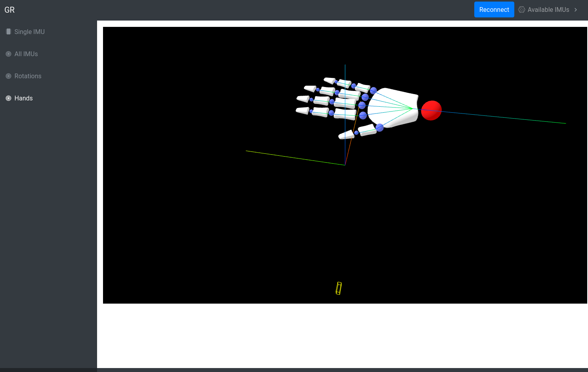

  

  <h1>👋 GR UI</h1>
  
User interface for GR - a Gesture Recognition and Tracking Palm-bracelet

## ✨ Tech stack

- 🌐 Three.js for 3d rendering
- ⚛️  Electon
- 🔵 React
- 🟣 Redux
- 📈 Chart.js

## 📦 Installation

`npm install`

`npm run build`

`npm start`

## 🤝 Contact

Email us at [brainhublab@gmail.com](mailto:brainhublab@gmail.com)
